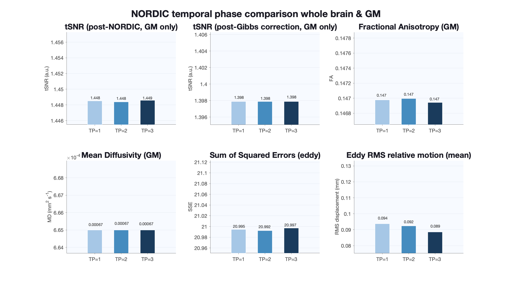

Final game plan for the dMRI preprocessing:
denoising with NORDIC ➡️ degibbs ➡️ TOPUP ➡️ EDDY ➡️ N4 (ants)

segmentation-related codes and docs will be updated soon (in feb 2026)

[04-03-2026] alex: all SDFlex pipeline has been validated and tested! i'm working on tidying up workflow, and i am considering adding tensor and tractography to this. stay tuned... most likely to be completed shortly before easter

